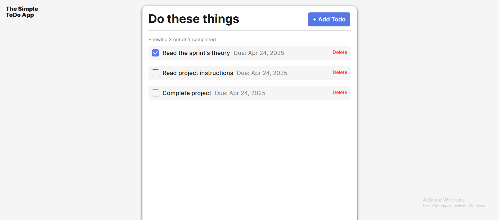
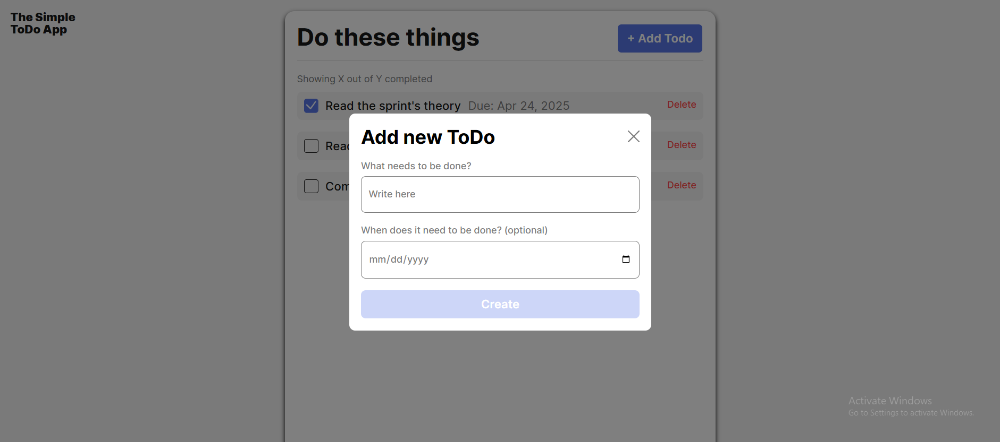
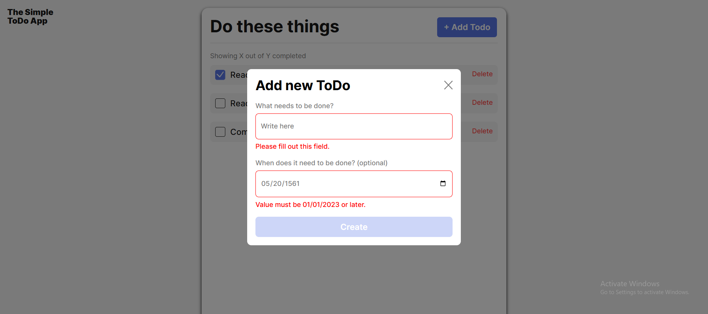

# Simple Todo App

Ths app allows users to create an organized list of tasks.

## Functionality

Users can create custom 'Todo' tasks, with labels and Due dates, with the ability to checkoff, delete and add more as their schedules change.

## Technology

This app was built using a combination of HTML, CSS and JavaScript. I created classes for the Todo tasks and Form validation for future scalability.

It is a simple app, it comes with a Home Page, A module to add new Tasks, and errors that will pop up when the data entered for a new task does not make sense (see screenshots below).

HomePage:

Add Tasks Form:

Prevent users for adding giberish data:

## Deployment

This project is deployed on GitHub Pages:

- ADD LINK HERE
